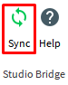

# Studio Bridge

[plugin-repo]: https://github.com/vocksel/studio-bridge-plugin
[cli-repo]: https://github.com/vocksel/studio-bridge-cli

Synchronize Lua code from your computer to Roblox Studio.


You lay out your project to mimic Roblox's hierarchy, and Studio Bridge does the rest.

```
src/
  ReplicatedStorage/
    Event.json
    Shared.module.lua
  ServerScriptService/
    Server.lua
  StarterPlayerScripts/
    StarterPlayer/
      Client.local.lua
```

**NOTE:** Studio Bridge is not suitable for Team Create. It actively overwrites the scripts it manages, immediately reverting any changes another user makes.

## Setup

Studio Bridge is a combination of a command-line interface and a Roblox plugin. This makes setup a bit tricky, but once complete you'll have significantly more control over your code.

### Plugin

The plugin is [hosted on Roblox's website](https://www.roblox.com/library/626028645/Studio-Bridge) and can be easily downloaded right from inside Studio.

### CLI

Install [NodeJS](https://nodejs.org), then run the following command to install the command-line interface:

```shell
$ npm install -g studio-bridge
```

The CLI should now be globally accessible on the command-line. Run the following to verify:

```shell
$ studio-bridge --version
```

This will display the CLI's current version. If this worked with no errors, the CLI is successfully installed.

### Game

In each game you want to use Studio Bridge with, you'll need to set `HttpService.HttpEnabled` to `true`. This allows the plugin to communicate with the server. Without HTTP requests, changes cannot be synced.

HttpEnabled can't be changed by plugins, so unfortunately this has to be done manually.

## Tutorial

This sections guides you through setting up a project on your computer and using Studio Bridge to sync it all to Studio

Start by creating a directory named `sample`, then create a file named `HelloWorld.lua` with the following contents:

```lua
print("Hello, World! I'm located at", script:GetFullName())
```

It should look something like this:


Next we want to start the server so the plugin has something to sync with. Run the `studio-bridge` command, passing in the `sample` directory:

```shell
$ studio-bridge sample/
Server started on http://localhost:8080
Using: C:\sample
```

Next click the plugin's "Sync" button from inside Studio.



If everything was setup correctly, you'll notice a `HelloWorld` Script at the same level as all the Roblox Services.


This is because Studio Bridge overlays the directory structure on the DataModel. To have your files show up under services like `ReplicatedStorage` and `ServerScriptServices`, you need to add directories with those names.

Move `HelloWorld.lua` into a new `ServerScriptService` directory:

```
sample/
  ServerScriptService/
    HelloWorld.lua
```

Be sure to delete the `HelloWorld` Script from the last sync. Studio Bridge doesn't remove things for you, so you'll have to do that manually.

When synced, the HelloWorld script now shows up under `ServerScriptService` in-game.


Run the game, and you should see the following in your output:


And that's all there is to getting your code from the filesystem into Studio. Getting setup is a bit of work, but once complete it's easy to code from your favorite text editor and have it synced over.

We only cover regular Scripts in this guide, but you'll no doubt want to make use of LocalScripts, ModuleScripts, and even things like RemoteEvents. This is all covered below.

## Instances

Studio Bridge converts folders and Lua files into their Roblox equivalents. JSON files can be used for more complex instances, like `Sounds` and `RemoteEvents`.

### Global Properties

These apply to every file/directory that Studio Bridge handles.

- The `Name` property is set to the name of the file/directory. If you had a file named `Sample.lua`, it would compile into a `Script` named `Sample`.

### Script Properties

Applies to all `.lua` files.

- `ClassName` is set by appending short versions of Script classes after the filename, like so:
  - `Sample.local.lua` compiles to a `LocalScript`.
  - `Sample.module.lua` compiles to a `ModuleScript`.
  - Anything else compiles to a `Script`. For consistency you can use `Sample.script.lua`.
- `Source` is set to the contents of the file.

### Folder Properties

- `ClassName` is set to `Folder` for all directories.

### Other Instances

JSON files make up every other instance.

To use them, you just make a list of properties. The only mandatory property is the `ClassName`. The `Name` property is still the name of the file.

For example, say you wanted to add a StarterHumanoid. Your files would look like this:

```
src/
  StarterPlayer/
    StarterHumanoid.json
```

And `StarterHumanoid.json` could have the following contents:

```json
{
  "ClassName": "Humanoid",
  "WalkSpeed": 20,
  "HealthDisplayDistance": 50
}
```

## Cleanup

All of your code, once synced, *will not be removed* by Studio Bridge. This means if you restructure your project, you'll need to delete everything from Studio manually.

## Contributing

The plugin and CLI are both hosted on independent GitHub repositories. To learn how to contribute to each one, check out their respective READMEs.

- [Plugin repo][plugin-repo].
- [CLI repo][cli-repo].
