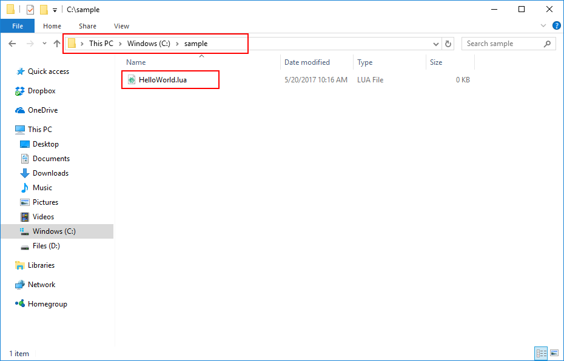

# Studio Bridge

[plugin-repo]: https://github.com/vocksel/studio-bridge-plugin
[cli-repo]: https://github.com/vocksel/studio-bridge-cli

Synchronize Lua code from your computer to Roblox Studio.


You lay out your project to mimic Roblox's hierarchy, and Studio Bridge does the rest.

```
src/
  ReplicatedStorage/
    Event.json
    Shared.module.lua
  ServerScriptService/
    Server.lua
  StarterPlayerScripts/
    StarterPlayer/
      Client.local.lua
```

**NOTE:** Studio Bridge is not suitable for Team Create. It actively overwrites the scripts it manages, reverting any changes another user makes immediately.

## Setup

Studio Bridge is a combination of a command-line interface and a Roblox plugin. This makes setup a bit tricky, but once complete you'll have significantly more control over your code.

### Plugin

The plugin is [hosted on Roblox's website](https://www.roblox.com/library/626028645/Studio-Bridge) and can be easily downloaded right from inside Studio.

### CLI

Install [NodeJS](https://nodejs.org), then run the following command to install the command-line interface:

```shell
$ npm install -g studio-bridge
```

The CLI should now be globally accessible on the command-line. Run the following to verify:

```shell
$ studio-bridge --version
```

This will display the CLI's current version. If this worked with no errors, the CLI is successfully installed.

### Game

In each game you want to use Studio Bridge with, you'll need to set `HttpService.HttpEnabled` to `true`. This allows the plugin to communicate with the server. Without HTTP requests, changes cannot be synced.

HttpEnabled can't be changed by plugins, so unfortunately this has to be done manually.

## Usage

Start by creating a directory named `sample`, then create a file named `HelloWorld.lua` with the following contents:

```lua
print("Hello, World! I'm located at", script:GetFullName())
```

It should look something like this:



Next we want to start the server so the plugin has something to sync with. Run the `studio-bridge` command, passing in the `sample` directory:

```shell
$ studio-bridge sample/
Server started on http://localhost:8080
Using: C:\sample
```

Click the plugin's "Sync" button, and if everything was setup correctly, you'll notice a `HelloWorld` Script at the same level as all the Roblox Services.


This is because Studio Bridge overlays the directory structure on the DataModel. To have your files show up under services like ReplicatedStorage and ServerScriptServices, you need to add directories with those names.

Move `HelloWorld.lua` into a new `ServerScriptService` directory:

```
sample/
  ServerScriptServive/
    HelloWorld.lua
```

Be sure to delete the `HelloWorld` Script from the last sync. Studio Bridge doesn't handle the removal of non-synced code, so you'll have to do that manually.

When synced, the HelloWorld script shows up under ServerScriptService in-game.


Run the game, and you should see the following in your output:


And that's all there is to it! You're all set to start incorporating Studio Bridge into your workflow. Getting setup is a bit of work, but once complete it's easy to code from your favorite text editor and have it synced to Studio.

This guide only covers plain Scripts, but you'll no doubt want to make use of LocalScripts and ModuleScripts in your game aswell. For configuring which Script class your file uses, see [Properties](#Properties) below.

## Properties

Roblox Studio has the Properties panel for configuring properties of your Scripts. This cannot be accessed on the filesystem, so to work around it we have the following rules:

### ClassName

`ClassName` is set by appending short versions of Script classes after the filename, like so:

- `Sample.local.lua` compiles to a `LocalScript`.
- `Sample.module.lua` compiles to a `ModuleScript`.
- Anything else compiles to a `Script`. For consistency you can use `Sample.script.lua`.

### Name

The `Name` property is set by the filename. `Sample.lua` would become a `Script` named `Sample`.

### Other Properties

All other properties can be set once Studio Bridge first syncs your files.

For example, you can toggle the Disabled property from the Properties panel and it will not be overridden next sync.

## Cleanup

All of your code, once synced, *will not be removed* by Studio Bridge. This means if you restructure your project, you'll need to delete everything from Studio manually.

## Contributing

The plugin and CLI are both hosted on independent GitHub repositories. To learn how to contribute to each one, check out their respective READMEs.

- [Plugin repo][plugin-repo].
- [CLI repo][cli-repo].
