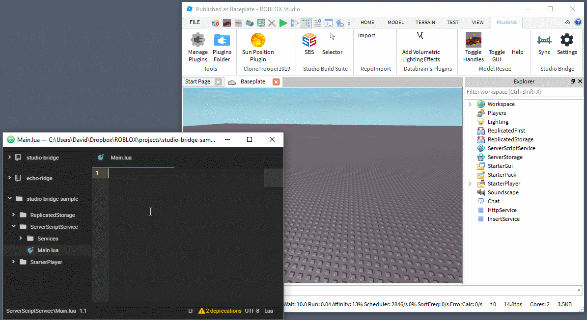
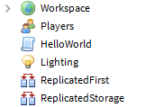
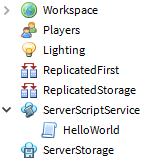
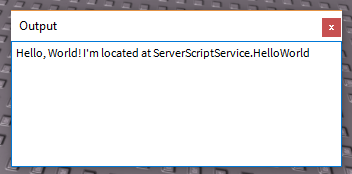

# Studio Bridge

Synchronize Lua code from your computer to Roblox Studio.



Studio Bridge is a combination of an HTTP server and a Roblox plugin. The server collects the files, and the plugin syncs the files to Studio.

Requires NodeJS 6.x.

## Setup

There are a few steps to getting everything setup, but once complete you'll be able to code in your favorite text editor and have your changes sync directly to Studio.

### Installing the Plugin

The plugin is hosted on Roblox's website and can be found [here](https://www.roblox.com/library/626028645/Studio-Bridge).

### Installing the CLI

Requires [NodeJS](https://nodejs.org) 6.x.

With NodeJS installed, run the following command to install the command-line interface for running the server:

```shell
$ npm install -g studio-bridge
```

### In Your Game

You'll need to set `HttpService.HttpEnabled` to `true` for the plugin to communicate with the server.

This has to be done in each game you want to use Studio Bridge with. HttpEnabled can't be changed by Plugins, so unfortunately this can't be handled for you.

## Usage

<!-- With the plugin and server installed, you're ready to start syncing your files from the filesystem to Studio.

Your workflow will be the following:

- Run `studio-bridge` on your source directory.
- Start syncing in Studio.
- Code in your favorite text editor. -->

Start by creating a directory named `src`, then add `HelloWorld.lua` with the following contents:

```lua
print("Hello, World! I'm located at", script:GetFullName())
```

Start up the server by running `studio-bridge src/` and sync your changes to the game with the plugin's `Sync` button.

When synced, you'll notice a `HelloWorld` Script at the same level as all the Roblox Services.



This is because Studio Bridge overlays the directory structure on the DataModel. To have your files show up under services like ReplicatedStorage and ServerScriptServices, you need to add directories with those names.

Move `HelloWorld.lua` into a new `ServerScriptService` directory:

```
src/
  ServerScriptServive/
    HelloWorld.lua
```

When synced, the HelloWorld script shows up under ServerScriptService in-game.



Run the game, and you should see the following in your output:



And that's all there is to it! You're all set to start incorporating Studio Bridge into your workflow. Getting setup is a bit of work, but once complete it's easy to code from your favorite text editor and have it synced to Studio.

This section only covers plain Scripts. You'll no doubt want to make use of LocalScripts and ModuleScripts in your game, so for configuring which Script class your file uses, see the next section.

## Properties

Roblox Studio has the Properties panel for configuring properties of your Scripts. This cannot be accessed on the filesystem, so to work around it we have the following rules:

### ClassName

`ClassName` is set by appending short versions of Script classes after the filename, like so:

- `Sample.local.lua` compiles to a `LocalScript`.
- `Sample.module.lua` compiles to a `ModuleScript`.
- Anything else compiles to a `Script`. For consistency you can use `Sample.script.lua`.

### Name

The `Name` property is set by the filename. `Sample.lua` would become a `Script` named `Sample`.

### Other Properties

All other properties can be set once Studio Bridge first syncs your files.

For example, you can toggle the Disabled property from the Properties panel and it will not be overridden next sync.

## Cleanup

All of your code, once synced, *will not be removed* by Studio Bridge. This means if you restructure your project, you'll need to delete everything from Studio manually.

## Contributing

The plugin and CLI are both hosted on independent GitHub repositories. To learn how to contribute to each one, check out their respective READMEs.

- [Plugin](https://github.com/vocksel/studio-bridge-plugin)
- [CLI](https://github.com/vocksel/studio-bridge-cli)
